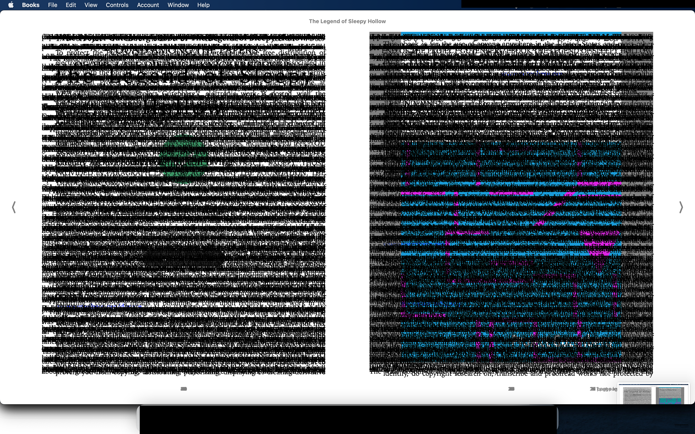
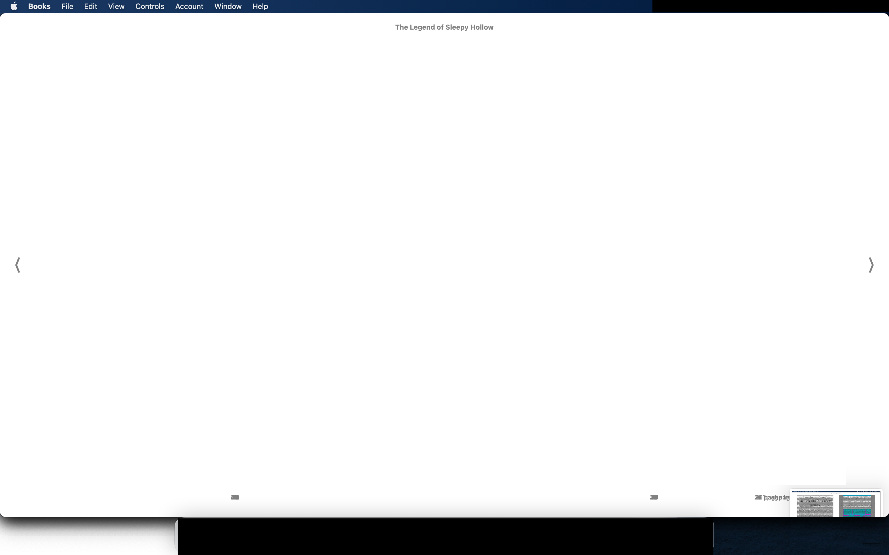

# snipbook

Snipbook is a small python CLI utility to convert a series of images (scans/screenshots) into a clean PDF. Either in preparation for OCR or just as-is.

Instead of one monolithic command, the workflow consists of 3 steps/commands, making it easy to run other programs (eg Imagemagick) on intermediate files.

# Requirements

`pip install numpy scipy pillow fpdf`

# Example

## Prepare: collect a series of images

For this example I started with 21 screenshots from [The Legend of Sleepy Hollow EPUB](https://www.gutenberg.org/ebooks/41).

**sh_screenshots/Screenshot 2025-02-20 at 21.47.56.png:**

<a href="doc/Screenshot 2025-02-20 at 21.47.56.png"></a>

## Step 1: _meld_ multiple images into 1 image

This helps to determine the regions where content is to be found (regions of interest, ROI).

```
% ./snipbook.py meld sh_screenshots/*.png --output sh_meld.png
Melding 21 images using method "min"
Saving to "sh_meld.png"
```

**sh_meld.png:**

<a href="doc/sh_meld.png"></a>

With the help of this image, I define the ROIs. For this example, I define 2 ROIs, since each source image contains 2 pages.

### Manual edit
Determine the rectangular ROIs with external software. Either by measuring the coordinates of the top left & bottom right of each region, or by creating transparent areas in the melded png. The transparent regions will be used as ROIs. Here I've done the latter, with macOS Preview:

**sh_meld.png:**

<a href="doc/sh_meld_2.png"></a>

## Step 2: _snip_ ROIs from images

In this step, content from the ROIs is extracted ('snipped') and saved in a separate directory. 

```
% ./snipbook.py snip sh_screenshots/*.png --roi sh_meld.png --crop #FFFFFF --outputdir sh_snips
```

This will load the files `sh_screenshots/*.png` and extract ('snip') 2 images for each one, as defined in the edited `sh_meld.png`. It saves them to `sh_snips/`.

The other way to pass ROIs is as coordinate list: `--roi [[left, top, right, bottom], ...]`.

By setting `--crop #FFFFFF`, it also performs an autocrop removing all whitespace around each snip. `--crop auto` would autocrop on the top left pixel value of the _input_ picture, which wouldn't work with these screenshots. The autocrop tolerance can be adjusted with `--tolerance`.

```
% ./snipbook.py snip sh_screenshots/*.png --roi sh_meld.png --crop #FFFFFF --outputdir sh_snips
Loading ROIs from sh_meld.png: 2 regions: [[195, 151, 1597, 1827], [1773, 136, 3196, 1833]]
Creating output directory 'sh_snips'
Snipping 2 regions from 21 images, crop #FFFFFF ±10%
1/42: Screenshot 2025-02-20 at 21.47.46-1.png
2/42: Screenshot 2025-02-20 at 21.47.46-2.png
...
41/42: Screenshot 2025-02-20 at 21.48.20-1.png
42/42: Screenshot 2025-02-20 at 21.48.20-2.png
```

**sh_snips/Screenshot 2025-02-20 at 21.47.56-1-1.png:**

<a href="doc/Screenshot 2025-02-20 at 21.47.56-1.png"></a>

**sh_snips/Screenshot 2025-02-20 at 21.47.56-1-2.png:**

<a href="doc/Screenshot 2025-02-20 at 21.47.56-2.png"></a>

### Manual edits
Now there's 42 image files saved in `sh_snips/`. A few of them are empty pages or otherwise pages I don't want. I remove them manually.

I also manually trimmed an additional ugly border around the cover page, which wasn't cropped automatically.

## Step 3: _merge_ snipped ROIs into a single PDF

The final step is to merge the snips into a PDF. All pages will have the exact same size, large enough for the biggest snip plus an empty margin around it.

You can manually set the page size (`--size`) OR the image dpi (`--dpi`).

```
% ~/Progs/snipbook.py merge sh_snips/*.png --dpi 300 --expand 1 --format png --output "The Legend of Sleepy Hollow.pdf"
```

Images can be embedded into the pdf as either png or jpeg. The `--expand` parameter allows to forgo the margin around a given page. This usually looks better for page 1 (the cover page), sometimes others too.

```
% ~/Progs/snipbook.py merge sh_snips/*.png --dpi 300 --expand 1 --format png --output "The Legend of Sleepy Hollow.pdf"
Loading dimensions (w×h):
	Largest input: [1378, 1653] px
	Page: [156.67, 179.95] mm
	Scale: 11.81 px/mm = 300.0 dpi
Merging 28 images into PDF with pillow options {'format': 'png', 'optimize': True}:
1/28: sh_snips/Screenshot 2025-02-20 at 21.47.46-2.png
2/28: sh_snips/Screenshot 2025-02-20 at 21.47.49-1.png
...
27/28: sh_snips/Screenshot 2025-02-20 at 21.48.05-2.png
28/28: sh_snips/Screenshot 2025-02-20 at 21.48.07-1.png
Writing to 'The Legend of Sleepy Hollow.pdf'
```
(note that after manually removing some snips, there were only 28 left)

The final result: [The Legend of Sleepy Hollow.pdf](doc/The%20Legend%20of%20Sleepy%20Hollow.pdf). This file can be used as-is or fed to OCR.

# Full doc / all parameters

```
% ~/snipbook.py -h                                                                              
usage: snipbook.py [-h] {meld,snip,merge} ...

Cut images and merge them into a PDF

positional arguments:
  {meld,snip,merge}
    meld             Step 1: Meld multiple images into 1 image, to determine ROIs
    snip             Step 2: Snip ROIs from images
    merge            Step 3: Merge snipped ROIs into a single PDF

options:
  -h, --help         show this help message and exit
```

```
% ./snipbook.py meld -h
usage: snipbook.py meld [-h] --output OUTPUT [--method {min,max}] files [files ...]

positional arguments:
  files                 input image files

options:
  -h, --help            show this help message and exit
  --output, -o OUTPUT   output PNG filename
  --method, -m {min,max}
                        melding method (default: min)
```

```
% ./snipbook.py snip -h
usage: snipbook.py snip [-h] --roi ROI --outputdir OUTPUTDIR [--crop CROP] [--tolerance TOLERANCE] [--format {png,jpeg}] files [files ...]

positional arguments:
  files                 input image files

options:
  -h, --help            show this help message and exit
  --roi, -r ROI         JSON list of areas [[left, top, right, bottom], ...], or file (PNG with transparent areas as ROIs)
  --outputdir, -o OUTPUTDIR
                        output directory
  --crop, -c CROP       autocrop color; options: 'no', '#xxxxxx' (hex RGB), 'auto' (topleft pixel color) (default: no)
  --tolerance, -t TOLERANCE
                        tolerance for autocrop color (in %; default: 10)
  --format, -f {png,jpeg}
                        output format (default: png)
```

```
% ./snipbook.py merge -h
usage: snipbook.py merge [-h] [--margin MARGIN] [--size SIZE] [--dpi DPI] [--expand [EXPAND ...]] --output OUTPUT [--format {jpeg,png}] [--pillow PILLOW] files [files ...]

positional arguments:
  files                 input image files

options:
  -h, --help            show this help message and exit
  --margin, -m MARGIN   margin around image (in mm; default: 20)
  --size, -s SIZE       output page size; options: auto (= largest input image + margins), A4, A5, letter, legal, "[123,456]" (in mm, w×h) (default: auto)
  --dpi, -d DPI         DPI for the image (only with size=auto, otherwise DPI is set automatically; default: 72)
  --expand, -e [EXPAND ...]
                        expand image on this page to the full page, without margin
  --output, -o OUTPUT   output PDF filename
  --format, -f {jpeg,png}
                        image format (default: jpeg)
  --pillow, -p PILLOW   pillow image saving parameters, in JSON. See https://pillow.readthedocs.io/en/stable/handbook/image-file-formats.html. (auto = png: '{"optimize": true}'; jpeg:
                        '{"quality": 50}'). (default: auto)
```

## License

[Creative Commons BY-NC 4.0](https://creativecommons.org/licenses/by-nc/4.0/)